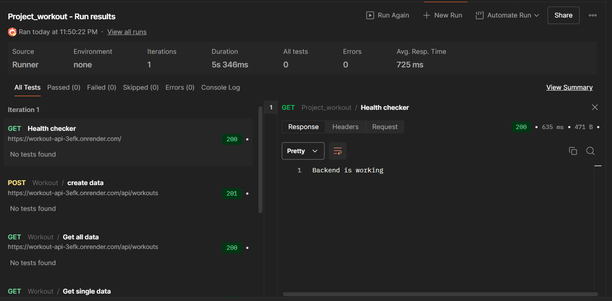
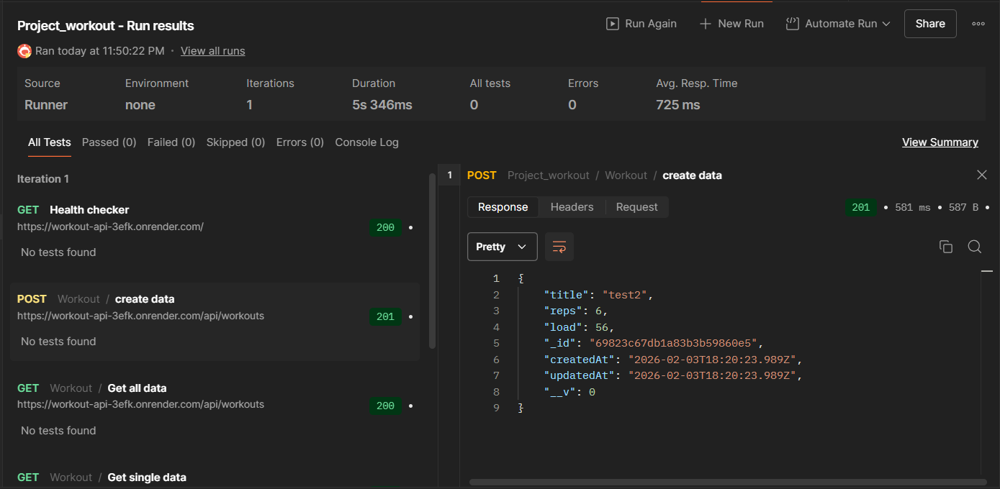
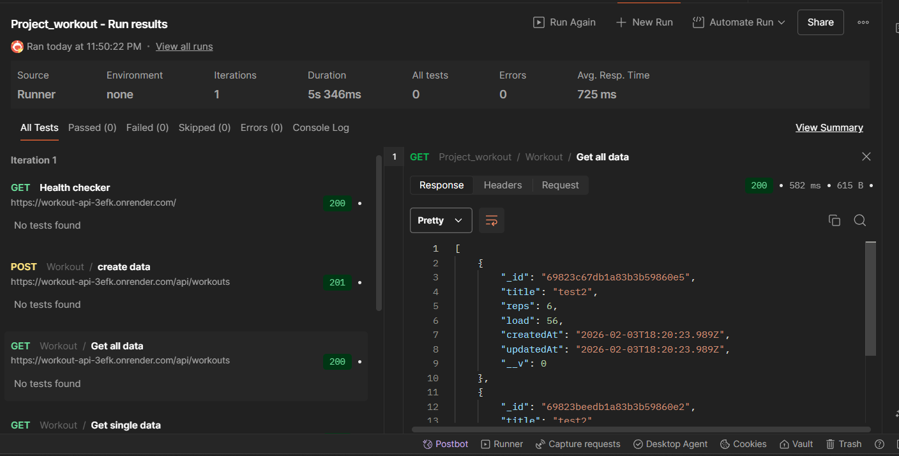
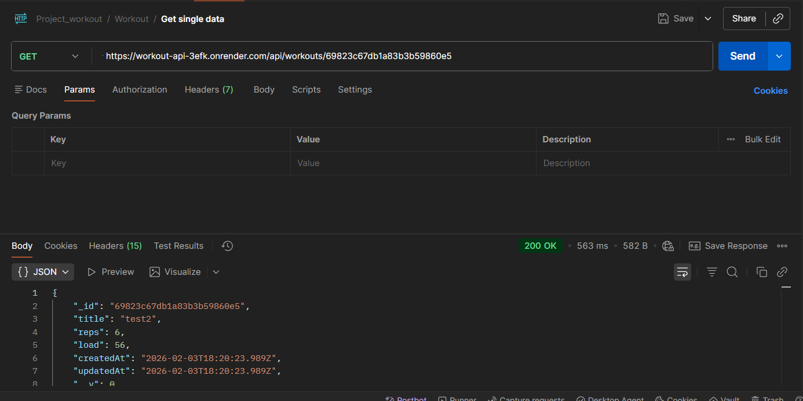
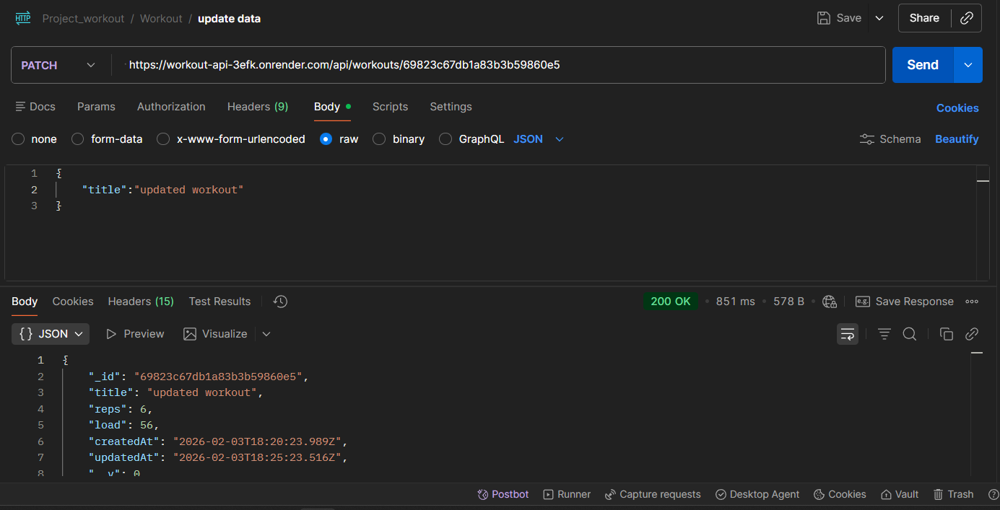
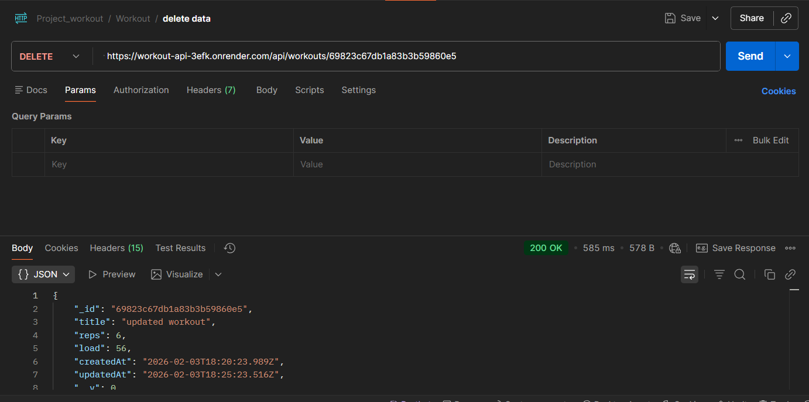

# 🏋️ Workout API

A RESTful backend API for managing workout routines, built using Node.js, Express.js, and MongoDB.  
The API is deployed on Render and provides full CRUD functionality following clean backend architecture and REST conventions.

## 🌐 Live API
https://workout-api-3efk.onrender.com/


---

## 🚀 Features

- RESTful API design using Express.js
- Full CRUD operations for workout management
- MongoDB data modeling using Mongoose
- MVC-based project structure
- Environment-based configuration
- Deployed and publicly accessible on Render

---

## 🛠️ Tech Stack

- **Backend:** Node.js, Express.js  
- **Database:** MongoDB, Mongoose  
- **Deployment:** Render  
- **Tools:** Postman, dotenv  

---

## 📁 Project Structure

server/\
│── configs/\
│ ├── db.config.js\
│ └── env.config.js\
│── controllers/\
│ └── workout.controller.js\
│── models/\
│ └── workout.model.js\
│── routes/\
│ └── workout.route.js\
│── index.js\
│── package.json\


---

## 🔗 API Endpoints

| Method | Endpoint           | Description             |
|------|-------------------|-------------------------|
| POST | api/workouts         | Create a new workout    |
| GET  | api/workouts         | Get all workouts        |
| GET  | api/workouts/:id     | Get workout by ID       |
| PATCH  | api/workouts/:id     | Update a workout        |
| DELETE | api/workouts/:id   | Delete a workout        |

---

## 🧪 API Testing

- All endpoints tested using **Postman**
- Validated request payloads and response formats
- Verified proper HTTP status codes
- Handled edge cases such as invalid IDs and missing fields

---

## 📸 API Screenshots / Postman Examples

Add the following screenshots in this section:

- **Create Workout (POST api/workouts)** – Request body and success response  

- **Get All Workouts (GET api/workouts)** – List of all workouts  

- **Get Workout by ID (GET api/workouts/:id)** – Single workout data  

- **Update Workout (PATCH api/workouts/:id)** – Updated workout response  

- **Delete Workout (DELETE api/workouts/:id)** – Deletion confirmation  


---

## ⚙️ Local Setup

```bash
git clone <repository-url>
cd server
npm install
npm start
```
Create a .env file in the root directory:

PORT=5000\
MONGO_URI=your_mongodb_connection_string

## 🚀 Deployment

The API is deployed on Render and is publicly accessible via the live URL.

## 🎯 Learning Outcomes

-Designed real-world REST APIs

-Implemented MongoDB schema modeling with Mongoose

-Learned backend project structuring using MVC

-Gained experience deploying Node.js applications

## 👤 Author

Kanhaiya Kumar Sahu\
B.Tech, Mathematics & Computing\
Indian Institute of Technology, Ropar

